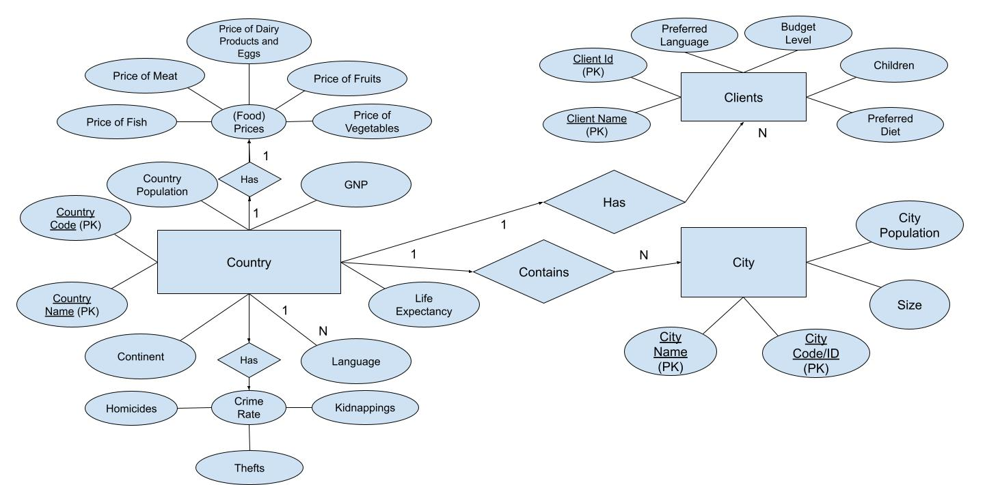
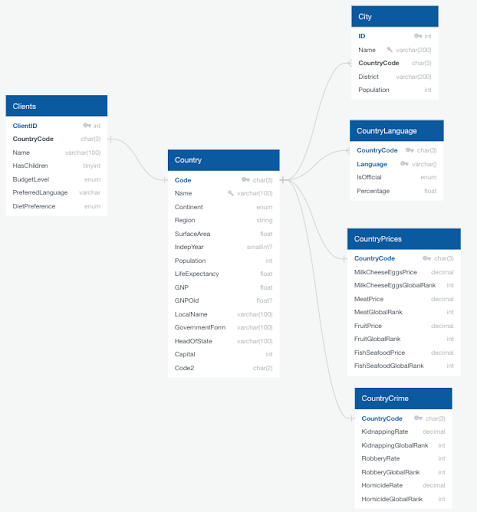

# 🌍 **Global Travel Database** ✈️

### A SQL-based travel insights project using MySQL.

---

## Table of Contents
1. [Overview](#overview)
2. [Project Structure](#project-structure)
3. [Technologies Used](#technologies-used)
4. [Database Schema & ER Diagram](#database-schema--er-diagram)
5. [SQL Queries](#sql-queries)
6. [Challenges Faced](#challenges-faced)
7. [Installation Instructions](#installation-instructions)
8. [Future Improvements](#future-improvements)

---

## Overview

The **Global Travel Database** is a structured SQL-based project designed to help travel agencies and clients find **ideal travel destinations** based on various factors like **language, safety, food prices, and economic conditions**. 

This project utilizes a **relational database structure** with multiple connected tables, including **Country, City, Clients, Crime Data, and Prices**, to generate meaningful insights through SQL queries.

### **Key Features**
- **SQL Database Schema** with properly designed relationships
- **20 SQL Queries** for travel-related insights
- **Entity-Relationship (ER) Diagram** & **Physical Model**
- **Use of Joins & Subqueries** to derive meaningful travel insights
- **Filtering based on safety, affordability, and client preferences**

---

## Project Structure
📁 **`database.sql`**  
> SQL file containing **table creation, data insertion, and query execution** scripts.

📁 **`ER-Diagram.png`**  
> Diagram illustrating the **entity relationships** in the database.

📁 **`Physical-Model.png`**  
> Diagram showing the **primary keys, foreign keys, and data types** used.

📁 **`queries/`**  
> Folder containing categorized SQL queries for better readability.
> 
---

## **Technologies Used**
- **SQL** (MySQL)
- **Relational Database Design**
- **ER Modeling**
- **Data Analysis**

---

## **Database Schema & ER Diagram**
### **Entity-Relationship Diagram**


### **Physical Model**


---

## **SQL Queries**
Here are a few sample queries and their purpose:

### **1. Find all cities with a population greater than 1 million**
**Purpose**: Identify major metropolitan areas for potential tourism.
```sql
SELECT City.Name AS CityName, Country.Name AS CountryName, City.Population
FROM City
JOIN Country ON City.CountryCode = Country.Code
WHERE City.Population > 1000000;
```

### 2. Find countries with high life expectancy and low population density**
**Purpose**: Suggest destinations that offer a **healthy and relaxing environment**.
```sql
SELECT Name
FROM Country
WHERE LifeExpectancy > 75 AND (Population / SurfaceArea) < 50;
```

### 3. Find countries in Europe with affordable fish prices
Purpose: Recommend budget-friendly European destinations for pescatarians.
```sql
SELECT Name
FROM Country
WHERE Code IN (SELECT CountryCode FROM CountryPrices WHERE FishSeafoodPrice < 100) 
AND Continent = 'Europe';
```


For the complete list of queries, check out:

- [Join Queries](queries/join-queries.sql) - SQL queries using JOIN operations.
- [Subqueries](queries/subqueries.sql) - SQL queries with subqueries for advanced filtering.
- [Additional Queries](queries/additional-queries.sql) - Other travel-related SQL queries.

---

## Challenges Faced
- **Data Availability**: Some **countries did not have available data**, affecting certain queries.
- **Foreign Key Relationships**: Initially, the **Clients table lacked a foreign key**, making **JOIN queries difficult**.
- **Data Sourcing**: Finding reliable data sources was challenging.

---

## **Installation Instructions**

### **For MySQL Users:**
1. **Clone the Repository**:
   ```bash
   git clone https://github.com/yourusername/Global-Travel-Database.git
   ```
2. **Import the Database**:
   ```bash
   mysql -u your_user -p < database.sql
   ```
3. **Use the Travel Database**:
   ```sql
   USE travel_database;
   ```
4. **Run Queries & Explore Insights**:
   Execute any of the provided SQL queries to generate travel insights.

---

## **Future Improvements**
🚀 **Enhancements for this project**:
- **🔍 More Data Categories**: Add **climate data, tourist attractions, and cost of living**.
- **📊 Visualization Tools**: Implement **Tableau, Power BI, or Python Matplotlib** for insights.
- **🖥️ Web Application**: Develop a **Flask or Django-based UI** for user-friendly access.

---

## **References**
- **The Global Economy** - *(Data on food prices, crime rates, and economic indicators)*  
  - [Fish & Seafood Prices](https://www.theglobaleconomy.com/rankings/fish_seafood_prices_wb/) *(TheGlobalEconomy.com, 2017)*  
  - [Meat Prices](https://www.theglobaleconomy.com/rankings/meat_prices_wb/) *(TheGlobalEconomy.com, 2017)*  
  - [Milk, Cheese, and Eggs Prices](https://www.theglobaleconomy.com/rankings/milk_cheese_eggs_prices_wb/) *(TheGlobalEconomy.com, 2017)*  
  - [Fruit Prices](https://www.theglobaleconomy.com/rankings/fruit_prices_wb/) *(TheGlobalEconomy.com, 2017)*  
  - [Kidnapping Rates](https://www.theglobaleconomy.com/rankings/kidnapping/) *(TheGlobalEconomy.com, 2017)*  
  - [Robbery Rates](https://www.theglobaleconomy.com/rankings/robery/) *(TheGlobalEconomy.com, 2017)*  
  - [Homicide Rates](https://www.theglobaleconomy.com/rankings/homicide_rate/) *(TheGlobalEconomy.com, 2017)*  

---

## **License**
This project is licensed under the **MIT License**. Feel free to use and modify it.
